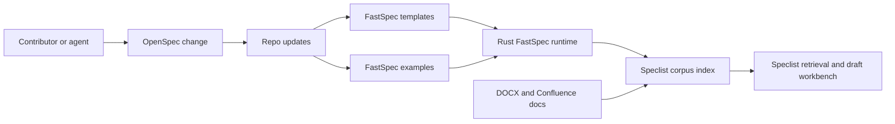

# Architecture

FastSpec uses a two-layer model:

- OpenSpec handles change-time work such as proposals, scoped specs, designs, tasks, and archival.
- FastSpec YAML handles durable domain knowledge that should be easy for agents to retrieve and compose.

The next platform layer extends the current corpus index into a shared service
topology:

- PostgreSQL for marketplace metadata and publication state
- ClickHouse for ingestion and ranking analytics
- Valkey for caches, queues, and coordination
- Qdrant for vector and hybrid retrieval
- Traefik, CrowdSec, and Trivy-backed validation for production operations

See `docs/speclist-platform-ops.md` for the concrete operating model.

## Near-Term Modules

- `apps/fastspec-cli/` for the command-line entrypoint
- `apps/speclist-api/` for ingestion, retrieval, and grounded draft generation
- `apps/speclist-web/` for source import, search, and draft review
- `crates/fastspec-core/` for shared tree inspection and validation logic
- `crates/fastspec-model/` for document kind detection and shared model helpers

## Artifact Classes

- `proposal.md`, `design.md`, `tasks.md`: short-lived change execution artifacts
- `templates/*.yaml`: reusable document starters
- `examples/**`: realistic reference inputs
- imported Speclist corpus entries: normalized document chunks with citations and metadata
- future archived `openspec/specs/**`: stable requirements after changes are compacted
