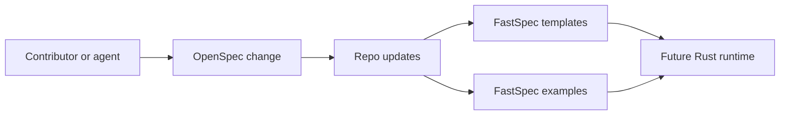

# Architecture

FastSpec uses a two-layer model:

- OpenSpec handles change-time work such as proposals, scoped specs, designs, tasks, and archival.
- FastSpec YAML handles durable domain knowledge that should be easy for agents to retrieve and compose.

## Near-Term Modules

- `apps/fastspec-cli/` for the command-line entrypoint
- `crates/fastspec-core/` for shared tree inspection and validation logic
- `crates/fastspec-model/` for document kind detection and shared model helpers

## Artifact Classes

- `proposal.md`, `design.md`, `tasks.md`: short-lived change execution artifacts
- `templates/*.yaml`: reusable document starters
- `examples/**`: realistic reference inputs
- future archived `openspec/specs/**`: stable requirements after changes are compacted
