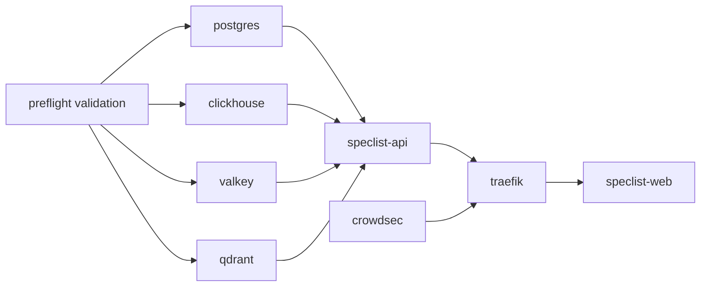

# Speclist Platform Ops

This document implements the `add-speclist-platform-ops` change by defining the
initial marketplace domain, storage topology, retrieval baseline, security
gates, and delivery model for the broader Speclist platform.

## 1. Platform Architecture And Storage

### 1.1 Marketplace Domain Model

The platform treats published specs as marketplace assets rather than only local
draft outputs.

| Entity | Purpose | Core fields |
| --- | --- | --- |
| `PublishedSpec` | Canonical published unit shown in the marketplace and used by the workbench | slug, title, summary, owner, visibility, version, tags, lifecycle |
| `SearchAsset` | Searchable projection of a spec-related source | asset kind, uri, checksum, language, source kind, keywords, embedding refs |
| `ReusableArtifact` | Reusable template, policy pack, export bundle, taxonomy, or prompt asset linked to a published spec | artifact kind, format, compatibility, origin spec, reuse metadata |
| `AssetLink` | Relationship edge between specs, docs, code, IR, and reusable artifacts | relation type, source asset, target asset, confidence, provenance |
| `IngestionRun` | Execution record for import, enrichment, indexing, and publication | run id, stage, source ref, status, timings, diagnostics |

The workbench becomes one surface over these shared platform entities:

- Authors publish a reviewed draft as a `PublishedSpec`.
- Enrichment pipelines derive one or more `SearchAsset` records from the
  published spec, linked docs, repository markdown, code, and supported IR.
- Generated templates, policy bundles, or exportable starters become
  `ReusableArtifact` records so they can be discovered and reused independently.
- Search and generation consume the same platform entities, which keeps the UI,
  API, and later marketplace surfaces aligned.

### 1.2 DB-Agnostic Ports And Concrete Adapter Roles

The domain layer stays backend-agnostic by speaking through stable ports while
the default production stack maps those ports onto specialized services.

| Port | Responsibility | Default adapter |
| --- | --- | --- |
| catalog store | transactional metadata for published specs, search assets, reusable artifacts, and access control | PostgreSQL |
| asset graph store | typed links between specs, docs, code, IR, and reusable artifacts | PostgreSQL |
| analytics store | ingestion telemetry, ranking observations, and operational events | ClickHouse |
| cache store | hot query caches, embedding memoization, and short-lived publication state | Valkey |
| queue store | ingestion jobs, re-index requests, and generation work dispatch | Valkey streams/lists |
| retrieval index | dense, sparse, and hybrid retrieval for specs, markdown, code, and IR chunks | Qdrant |

Default ownership per backend:

- PostgreSQL stores relational marketplace metadata, publication state,
  provenance, RBAC-ready ownership records, and referential links.
- ClickHouse stores append-heavy events such as ingestion timings, ranking
  features, query analytics, and retrieval quality measurements.
- Valkey stores low-latency caches, rate limits, background queues, and
  distributed locks for index or publish workflows.
- Qdrant stores vectors and hybrid-search payloads for source chunks,
  symbol-level code fragments, and IR-derived retrieval units.

This split keeps the domain contracts stable while allowing later adapter swaps
or narrower implementation slices.

### 1.3 Initial Vector Retrieval Baseline

The initial retrieval baseline is Qdrant-backed hybrid search.

Why Qdrant:

- It supports dense retrieval for semantic spec and documentation search.
- It supports hybrid and multivector patterns needed for code plus prose
  retrieval.
- It can attach payload filters for source kind, language, repo, publication
  status, and marketplace visibility.
- It gives a concrete default without coupling the application domain to a
  vector-vendor-specific API.

Baseline evaluation against required search needs:

| Need | Baseline approach |
| --- | --- |
| structured spec retrieval | index requirement statements, acceptance scenarios, tags, and section paths as chunk payloads plus embeddings |
| GitHub markdown retrieval | chunk markdown by heading and list/table structure, store source repo and path filters |
| code search | chunk by file, symbol, and semantic region; attach language, repo, and symbol payloads |
| IR-aware retrieval | index normalized AST or symbol-graph excerpts as first-class assets with links back to source code |
| hybrid ranking | combine lexical terms, filters, and vector similarity before platform reranking |

## 2. ML, RAG, And Indexing Pipelines

### 2.1 Ingestion And NLP Enrichment Stages

The ingestion flow is source-type aware.

1. Source capture
   Fetch DOCX, Confluence, repo markdown, structured specs, code, and supported
   IR-oriented exports.
2. Normalization
   Convert sources into canonical UTF-8 text plus structural metadata such as
   heading path, requirement ids, repo path, language, and ownership.
3. Structural parsing
   Extract spec sections, markdown hierarchy, code symbols, and IR nodes.
4. NLP enrichment
   Add taxonomy tags, section classification, named entities, glossary terms,
   dependency references, and publication candidates.
5. Retrieval packaging
   Build retrieval chunks, keyword features, sparse terms, and embedding jobs.
6. Publication indexing
   Persist marketplace metadata, event telemetry, cache entries, and retrieval
   records.

Required supported source classes:

- structured specs
- markdown documents from GitHub or repo-local sources
- source code files
- IR-oriented assets such as symbol graphs or AST-derived summaries
- imported prose documents such as DOCX and Confluence pages

### 2.2 Indexing And Ranking Flow

Hybrid search should combine source-aware indexing with staged ranking:

1. Filter candidates by tenant, visibility, source kind, language, tag, and
   publication state.
2. Run lexical retrieval over titles, keywords, requirement statements, symbol
   names, and chunk text.
3. Run vector retrieval over semantic chunk embeddings, code-symbol embeddings,
   and IR-summary embeddings.
4. Merge and de-duplicate candidates by marketplace asset identity.
5. Re-rank using source-aware features:
   spec structure match, heading proximity, symbol match, recency, reuse score,
   and prior operator feedback.
6. Return mixed results with explicit source type labels so the workbench and
   later marketplace surfaces can present specs, docs, code, and reusable
   artifacts together.

### 2.3 Follow-On Implementation Slices

This umbrella change should be implemented later through focused slices:

| Slice | Scope |
| --- | --- |
| marketplace search | published-spec catalog, result cards, filters, and reusable artifact discovery |
| ML enrichment | normalization jobs, NLP tagging, code and IR extraction, and embedding pipelines |
| generation quality | retrieval evaluation, grounding diagnostics, ranking feedback loops, and response-quality measurements |

## 3. Production Security Gates

### 3.1 Production Docker Compose Topology

The production-grade compose baseline includes:

- `traefik` for ingress, TLS termination, and routing
- `crowdsec` plus a Traefik bouncer for behavioral protection
- `trivy` validation jobs for image and config scanning
- `speclist-api`
- `speclist-web`
- `postgres`
- `clickhouse`
- `valkey`
- `qdrant`
- a `preflight` validation container that runs before long-lived services start

Recommended startup dependency chain:

### 3.2 Secret And Password Validation Rules

`docker compose up -d` must fail fast when any of these rules are violated:

- required secrets are unset
- placeholder values such as `changeme`, `password`, `admin`, or `example`
  appear in runtime config
- passwords fail minimum length and entropy checks
- secrets are committed directly in compose manifests or `.env` examples without
  explicit placeholder markers
- TLS or routing protections required by the deployment profile are disabled
- service credentials are re-used across unrelated components

### 3.3 Enforcement Before Startup

Enforcement happens in three layers:

1. Secret scanning
   Trivy config/secret scanning runs against compose files, env files, and image
   definitions.
2. Password linting
   A preflight validator checks for weak defaults, repeated credentials, missing
   secrets, and malformed URLs or DSNs.
3. Config validation
   The preflight container validates that required compose profiles, TLS inputs,
   network policies, and service dependencies are present.

If any validation fails, the preflight container exits non-zero and all long
running services stay blocked.

## 4. Delivery And Cluster Operations

### 4.1 GitHub CI/CD Stages

The GitHub delivery path should run these ordered stages:

1. lint and unit tests
2. frontend and backend build
3. OpenSpec and template validation
4. security validation
   Trivy image/config scan, secret scanning, and password-policy checks
5. integration tests
   compose smoke tests against the platform topology
6. release packaging
   container images, SBOMs, and Helm chart artifacts
7. deploy
   environment-gated Helm release into Kubernetes

### 4.2 Kubernetes Delivery Architecture

Cluster delivery uses:

- Helm charts for `speclist-api`, `speclist-web`, ingress, and supporting jobs
- Vault-backed secret injection for app settings, DSNs, tokens, and registry
  credentials
- environment overlays for dev, staging, and production values
- pre-upgrade and post-upgrade Helm hooks for migration, validation, and smoke
  checks
- ingress policy aligned with Traefik or the target cluster ingress controller

Vault is the system of record for runtime secrets; Helm values reference secret
paths or injected references rather than storing raw credentials.

### 4.3 Delivery Rollout Slices

Cluster delivery should be implemented in this order:

| Slice | Goal |
| --- | --- |
| local compose | establish the production-like local stack and startup-blocking security gates |
| CI/CD | wire GitHub Actions to build, scan, test, package, and publish deployable artifacts |
| Kubernetes rollout | add Helm charts, Vault-backed secret injection, and staged cluster rollout |
