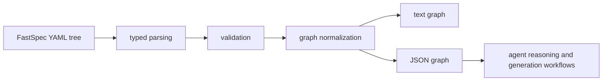

## Context

FastSpec can now parse documents, inspect them, and report structured validation findings, but it still does not expose a normalized project graph. Agents currently have to reconstruct graph structure themselves from project, module, and workflow documents.

This change adds a graph export layer on top of the validated runtime model. OpenSpec continues to describe the implementation slice, while the Rust runtime produces a durable graph view of the FastSpec YAML tree that can be consumed in text or JSON form.

For retrieval, this keeps the YAML as the source of truth while providing a stable derived representation that agents can consume without re-deriving relationships.

## Goals / Non-Goals

**Goals:**
- Add a `graph` command for validated FastSpec trees.
- Export a normalized graph containing project, module, and workflow nodes.
- Represent key relationships such as project containment and internal module dependencies as explicit edges.
- Support both text and JSON output modes.

**Non-Goals:**
- Build a full graph query engine.
- Infer undocumented relationships beyond the current explicit FastSpec fields.
- Export external service dependencies as first-class nodes in this slice.

## Decisions

Require graph export to operate on a validation-clean tree.
Rationale: graph consumers should not have to reason about malformed relationship data, and the project already has a validation command that can gate this.
Alternative considered: emit partial graphs with warnings. Rejected because it weakens downstream assumptions too early.

Use explicit graph node and edge structs with stable identifiers and relation kinds.
Rationale: downstream agents need a normalized graph shape, not loosely formatted text.
Alternative considered: serialize the original documents and let consumers derive edges. Rejected because it duplicates work and encourages inconsistent graph logic.

Limit the first graph model to project, module, and workflow nodes, with `contains`, `defines_workflow`, and `depends_on` edges.
Rationale: these relationships are already present in the current example and sufficient to prove the graph surface.
Alternative considered: include inputs, outputs, and constraints as nodes immediately. Rejected because it would expand scope faster than current use cases justify.

## Risks / Trade-offs

[Graph export is too narrow for future examples] -> Keep node and edge kinds explicit so later changes can extend the schema without breaking the base model.

[Validation gating may make graph export feel strict] -> Return validation failures clearly and allow agents to inspect findings before retrying graph export.

[External dependencies are omitted from the graph] -> Document that only internal project structure is exported in this slice, leaving external dependency modeling for follow-up work.
