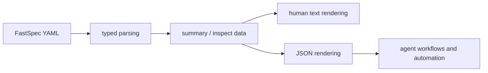

## Context

FastSpec now has typed YAML parsing and a small CLI, but the CLI surface is still terminal-first. That is adequate for humans, but weak for agents and automation because the output must be parsed from ad hoc text formatting.

This change adds a machine-readable rendering layer on top of the existing typed runtime model. OpenSpec continues to manage the short-lived implementation work, while the Rust runtime exposes durable FastSpec YAML artifacts in a stable JSON form that agents can consume directly.

For retrieval, this keeps the source of truth in YAML and the runtime model in Rust, while adding a structured export format that is easier for agents to chain into later tooling.

## Goals / Non-Goals

**Goals:**
- Add JSON output to the existing `summary` and `inspect` commands.
- Reuse the current typed parsing model rather than building a separate JSON-only code path.
- Keep the existing human-readable output as the default CLI behavior.
- Make the JSON shape stable enough for later automation and tests.

**Non-Goals:**
- Add new FastSpec document kinds.
- Replace the text UI with JSON-only output.
- Add external APIs, schema registries, or streaming output.

## Decisions

Use a flag-based interface, `--json`, on existing commands instead of separate JSON subcommands.
Rationale: it preserves the current CLI structure and keeps human and machine output modes aligned around the same commands.
Alternative considered: add commands such as `summary-json`. Rejected because it duplicates command semantics and scales poorly.

Derive JSON serialization from shared runtime structs and dedicated view structs where needed.
Rationale: the JSON mode should be backed by the same typed data already used for validation, while allowing the CLI to shape output without leaking every internal detail.
Alternative considered: manually format JSON strings in the CLI. Rejected because it is brittle and harder to test.

Expose both aggregate output and per-document detail in JSON.
Rationale: `summary` and `inspect` serve different use cases, and agents need both compact overviews and richer parsed views.
Alternative considered: reuse the same payload for both commands. Rejected because it would either overshare in `summary` or undershare in `inspect`.

## Risks / Trade-offs

[JSON shape drifts as the runtime evolves] -> Keep serialization tied to explicit CLI output structs and cover them with tests.

[Two output modes increase CLI complexity] -> Keep all parsing and validation shared, with only the final rendering branch split by format.

[Agents come to depend on undocumented fields] -> Document the intended JSON behavior in the CLI README and avoid exposing unstable internal-only fields.
