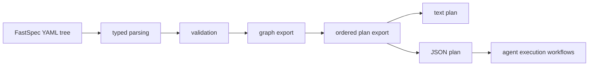

## Context

FastSpec can now export a validated project graph, but downstream agents still need to infer an execution order from that graph before they can act. The next useful runtime surface is a deterministic plan export that turns the graph into ordered implementation steps.

This change adds a planning layer on top of the validated graph export. OpenSpec continues to define the short-lived implementation slice, while the Rust runtime produces a durable derived plan that agents and humans can consume in text or JSON form.

For retrieval, this keeps the YAML and graph as durable intermediate representations while giving agents an explicit ordered plan instead of forcing them to reconstruct execution order.

## Goals / Non-Goals

**Goals:**
- Add a `plan` command for validation-clean FastSpec trees.
- Derive an ordered implementation plan from the exported project graph.
- Include explicit step IDs, phases, titles, and dependency references.
- Support both text and JSON output.

**Non-Goals:**
- Generate source code or files directly from the plan.
- Infer detailed implementation subtasks inside each module.
- Solve every possible project planning strategy in this slice.

## Decisions

Build plans from the normalized graph export instead of re-reading YAML directly.
Rationale: the graph already encodes the validated project structure, so planning should reuse that single derived representation.
Alternative considered: plan directly from parsed documents. Rejected because it duplicates graph relationship logic.

Represent the first plan as a small ordered list of high-level steps: project bootstrap, module implementation steps ordered by dependencies, then workflow-oriented steps.
Rationale: this is enough to prove the planning surface without inventing speculative low-level task generation.
Alternative considered: generate many fine-grained tasks immediately. Rejected because it would be hard to validate and easy to overfit.

Use dependency references between plan steps so agents can understand sequencing explicitly.
Rationale: ordering alone is not enough for downstream automation that may need to inspect or reorder safe parallel work later.
Alternative considered: expose only a numbered list. Rejected because it loses structure agents can consume programmatically.

## Risks / Trade-offs

[Plan steps are too coarse] -> Keep the plan schema explicit so later changes can refine step granularity without replacing the command.

[Workflow steps may not always belong after modules] -> Treat the initial ordering as a deterministic baseline tied to the current example shape.

[Graph ordering ambiguity produces unstable output] -> Sort nodes and use a deterministic topological strategy so plan output stays stable across runs.
