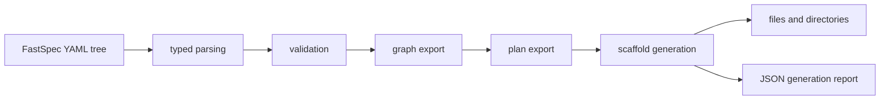

## Context

FastSpec can now export a validated graph and an ordered implementation plan, but it still leaves the user with no concrete filesystem result. The next useful runtime surface is a deterministic scaffold generator that turns the ordered plan into a starter workspace layout.

This change adds a small generation layer on top of plan export. OpenSpec continues to define the short-lived implementation slice, while the Rust runtime produces a first scaffold on disk plus a machine-readable report of generated artifacts.

For retrieval, this keeps the YAML, graph, and plan as durable intermediate layers while making the first concrete generated output reproducible.

## Goals / Non-Goals

**Goals:**
- Add a `generate` command that writes a deterministic starter scaffold to an explicit output directory.
- Reuse the validated plan rather than inventing a second generation path.
- Generate a small but useful filesystem layout for the current example shape.
- Support both text and JSON reporting of generated files.

**Non-Goals:**
- Generate runnable application code in this slice.
- Overwrite arbitrary existing files without guardrails.
- Support every future scaffold style or framework target.

## Decisions

Require an explicit `--out <dir>` argument for generation.
Rationale: generation is a mutating command and should not guess where files belong.
Alternative considered: default to a generated folder in the cwd. Rejected because it is too implicit for a write operation.

Generate a minimal deterministic scaffold: project README, module directories with stub READMEs, workflow markdown files, and a machine-readable manifest.
Rationale: this gives agents and humans a usable starting structure without pretending code generation already exists.
Alternative considered: generate framework-specific source trees immediately. Rejected because the project has not chosen a generation target yet.

Refuse generation when validation fails and treat existing non-empty output paths conservatively.
Rationale: generation should build on trusted structure and avoid silently mixing old and new outputs.
Alternative considered: generate partial output with warnings. Rejected because it weakens reproducibility.

## Risks / Trade-offs

[The scaffold is too generic] -> Keep the first generated shape small and derived from the plan so later changes can specialize it deliberately.

[Output collisions confuse users] -> Require an explicit output directory and fail when reserved generated files already exist.

[Plan changes ripple into generation output] -> Make the scaffold generator depend only on stable plan step and graph data rather than ad hoc text formatting.
