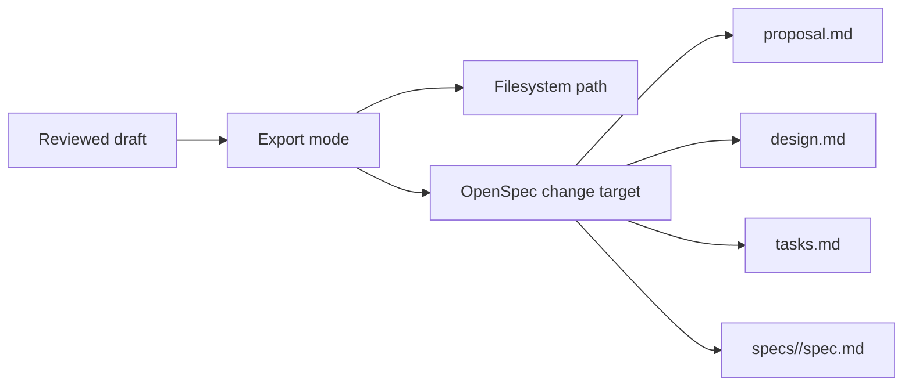

## Context

The previous Speclist export slice made drafts durable, but only through caller-provided directories and filenames. That works for raw file generation, but it is still awkward for the repo's actual workflow because contributors usually want to populate an active OpenSpec change rather than invent export paths by hand.

This slice makes Speclist aware of active OpenSpec changes without turning it into a general repo mutation engine. The backend lists active changes and resolves a small set of supported artifact targets. The frontend lets operators choose those targets explicitly.

## Goals / Non-Goals

**Goals:**
- Export reviewed drafts into active OpenSpec change artifacts.
- List active changes for the workbench through the backend.
- Keep change-target export explicit and conservative.

**Non-Goals:**
- Modify archived changes.
- Infer arbitrary OpenSpec artifact layouts beyond the supported set.
- Add automatic commit or PR behavior from Speclist.

## Decisions

Support only active changes discovered from `openspec/changes/*/.openspec.yaml`.
Rationale: this is the smallest reliable signal for repo-aware targeting.

Restrict supported artifact targets to `proposal`, `design`, `tasks`, and `spec`.
Rationale: these are the stable user-facing OpenSpec artifact classes already used in the repo.

Require OpenSpec-targeted export to stay on `openspec-markdown`.
Rationale: OpenSpec change artifacts are markdown files, so mixing YAML output into that mode would be incorrect.

## Risks / Trade-offs

[Repo-aware targeting could overwrite useful work] -> Keep no-overwrite behavior and require explicit change/artifact selection.

[Future OpenSpec schemas may vary] -> Scope this slice to the current spec-driven layout and extend later if needed.
