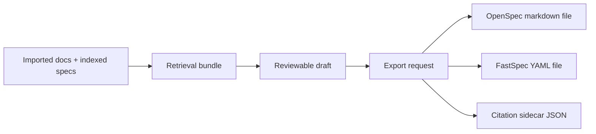

## Context

Speclist currently stops at a reviewable draft object returned from retrieval results. That proves the ingestion and RAG loop, but it does not complete the workflow that users actually need: taking a grounded draft and turning it into a durable artifact that can be committed, validated, or refined further in the repository.

This change adds an export step on top of the existing draft-generation flow. OpenSpec markdown and FastSpec YAML remain the durable targets. Speclist remains the short-path ingestion and retrieval workbench in front of those targets.

For retrieval, this means the draft object can no longer be treated as ephemeral display-only data. It becomes a portable intermediate representation that the backend can render into multiple durable formats.

## Goals / Non-Goals

**Goals:**
- Export reviewed drafts into explicit filesystem targets through the backend.
- Support both OpenSpec-style markdown and FastSpec-style YAML output.
- Preserve citations in both the rendered content and a machine-readable sidecar file.
- Add export controls to the existing React workbench.
- Keep export conservative by requiring explicit destination details and avoiding silent overwrite.

**Non-Goals:**
- Automatically modify existing active OpenSpec changes in-place.
- Fully infer the best FastSpec document kind from arbitrary retrieval results.
- Add git commits or PR creation directly from Speclist.
- Replace manual review of exported artifacts.

## Decisions

Use an explicit backend export endpoint rather than browser-only download generation.
Rationale: the browser cannot reliably write into repo paths, while the backend can enforce consistent file paths and overwrite rules.
Alternative considered: download blobs in the browser only. Rejected because it does not satisfy the goal of writing durable repo artifacts directly.

Model export as rendering from the existing draft object, not re-running retrieval during export.
Rationale: the reviewed draft is the user-approved intermediate. Export should serialize that object, not silently regenerate it.
Alternative considered: export by query only. Rejected because it introduces non-determinism between review and write.

Support two initial formats: `openspec-markdown` and `fastspec-yaml`.
Rationale: this gives one durable target for markdown workflow artifacts and one for YAML-first durable specs without exploding the matrix.
Alternative considered: one export format only. Rejected because the stated product direction explicitly spans both OpenSpec and FastSpec artifacts.

Write a citation sidecar JSON file next to every exported artifact.
Rationale: sidecar metadata stays machine-readable even when the primary artifact format is optimized for humans.
Alternative considered: embed citations only in the primary file. Rejected because machines would need to re-parse prose formatting to recover provenance.

## Risks / Trade-offs

[Exported FastSpec YAML may be generic rather than fully domain-specific] -> Keep the first YAML output shape simple and explicit, and preserve citations so later refinement remains grounded.

[Users may accidentally export into the wrong directory] -> Require an explicit target directory and return the exact written paths in the response.

[Overwrites could destroy work] -> Refuse to overwrite existing export files in this slice.

## Migration Plan

1. Add draft export types and rendering logic to the Speclist backend.
2. Expose an export endpoint that writes files and returns artifact paths.
3. Extend the React workbench with export format and destination controls.
4. Update docs to describe the new review-to-export workflow.

## Open Questions

- Should a later slice support exporting directly into active OpenSpec change directories with artifact-aware names?
- Should FastSpec YAML export later branch into typed project/module templates instead of a generic draft document shape?
