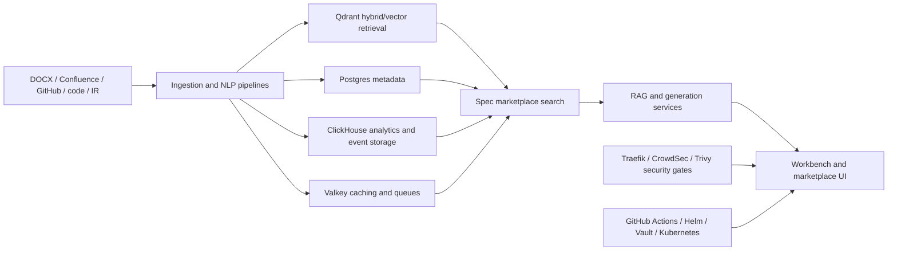

## Context

The current Speclist slices establish ingestion, retrieval, export, and OpenSpec-aware targeting. They do not yet define the product as a true multi-tenant or multi-team platform, nor do they define the production search/indexing, security, and deployment stack needed for marketplace-style usage.

This future change captures that direction without implementing it yet. The goal is to make the platform requirements explicit so later implementation slices can stay coherent.

## Goals / Non-Goals

**Goals:**
- Define Speclist as a spec marketplace/platform, not only a drafting workbench.
- Capture the required storage and indexing topology using PostgreSQL, ClickHouse, and Valkey.
- Define a scalable retrieval stack for structured specs, GitHub markdown, code, and IR-oriented language artifacts.
- Require production-grade container and cluster operations with startup-blocking security validation.
- Define a GitHub-to-Kubernetes delivery path with Helm and Vault-backed secret handling.

**Non-Goals:**
- Implement the full platform in this change.
- Lock every storage schema or deployment manifest at this stage.
- Replace future focused slices for marketplace, search, or delivery with one oversized implementation pass.

## Decisions

Keep the application architecture DB-agnostic at the domain layer while explicitly standardizing on PostgreSQL, ClickHouse, and Valkey for the initial production stack.
Rationale: the user wants DB agnosticism, but also wants a concrete default stack. The right compromise is stable ports/interfaces with an initial opinionated deployment.
Alternative considered: one database for everything. Rejected because search, analytics, transactions, and caching have different operating characteristics.

Recommend Qdrant as the initial vector and hybrid retrieval engine.
Rationale: this is an inference from Qdrant's official documentation, which currently covers semantic code search, hybrid retrieval, and multivector search. That makes it a stronger fit for code, markdown, and IR-heavy retrieval than a simpler embedding-only layer.
Alternative considered: defer vector DB choice completely. Rejected because the platform specs need at least one concrete baseline to design against.

Treat code, GitHub markdown, and language intermediate representations as first-class indexed sources.
Rationale: the platform is intended for serious spec retrieval, not just document upload. Code and IR metadata must participate in search and grounding.
Alternative considered: docs-only retrieval. Rejected because it leaves major technical context out of the platform.

Interpret the requested `travis` security tool as `Trivy`.
Rationale: in the current repo context, Trivy is already the preferred security scanner and fits the requested “block startup on security issues” behavior much better than Travis CI.
Alternative considered: preserve the literal term `travis`. Rejected because it conflicts with the separate CI/CD requirement and the surrounding security-tool wording.

Require startup-blocking security validation for Docker Compose.
Rationale: if secrets are hardcoded, weak, or missing required safeguards, `docker compose up -d` should fail fast rather than boot an unsafe stack.
Alternative considered: warnings only. Rejected because the user explicitly wants startup blocked on security issues.

## Risks / Trade-offs

[The platform scope is too broad for one implementation slice] -> Keep this as a specification umbrella and split implementation into smaller follow-on changes.

[Search quality varies across specs, markdown, code, and IR] -> Define source-type-aware indexing and ranking pipelines instead of one generic chunking path.

[Operational complexity grows quickly with multiple data services and security gates] -> Standardize on Docker Compose for local/prod-like stacks and Helm+Vault for cluster deployment.

[Security validation can become noisy or brittle] -> Separate policy definition, secret linting, and startup gating so failures are explainable and actionable.

## Open Questions

- Which IR forms should be first-class in the initial implementation: AST extracts, SSA-like IR, LSP symbol graphs, or all three?
- Should marketplace publication start as repo-local federation or a centralized catalog service?
- Which NLP enrichment steps should be baseline: entity extraction, taxonomy tagging, section classification, or all of them?
