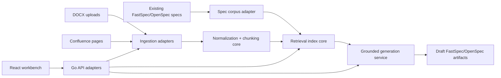

## Context

FastSpec is good at defining compact durable specs, but it does not yet help teams convert existing documentation into that format or reuse an accumulated spec corpus during authoring. The requested feature introduces `speclist`, a separate product surface that ingests DOCX and Confluence documentation, indexes imported sources and existing specs, and serves grounded retrieval context for drafting new specs.

This is intentionally framed as a service pair:
- `speclist-api`: Go backend microservice using hexagonal architecture
- `speclist-web`: React frontend for ingestion, retrieval, and draft creation

OpenSpec remains the workflow for proposing implementation slices. FastSpec YAML remains the durable spec format. `speclist` becomes the bridge between unstructured source documentation and durable FastSpec/OpenSpec artifacts.

For retrieval, this separates durable source material from generated drafts. Users and agents can trace each generated spec section back to imported documents or existing specs instead of relying on opaque prompts.

## Goals / Non-Goals

**Goals:**
- Ingest DOCX files and Confluence pages into a normalized, citation-preserving corpus.
- Index existing repository specs together with imported documentation for retrieval.
- Return grounded retrieval bundles that can be used to draft new specs.
- Provide a simple UI for ingestion, search, and draft generation review.
- Keep the backend modular with ports/adapters so indexing, storage, and source connectors can evolve independently.

**Non-Goals:**
- Build a full general-purpose knowledge management platform.
- Implement every documentation source in the first slice beyond DOCX and Confluence.
- Guarantee perfect autonomous spec generation without human review.
- Replace the existing Rust FastSpec CLI for local validation and generation workflows.

## Decisions

Use a dedicated product name and service split: `speclist-api` and `speclist-web`.
Rationale: the user asked for a named service with backend and frontend, and the split keeps the ingestion/retrieval backend independently deployable.
Alternative considered: extend the Rust CLI only. Rejected because ingestion, search, and operator workflows need a persistent multi-user surface.

Use Go for the backend and React for the frontend, even though the repo defaults to Rust.
Rationale: this change is explicitly a product exception with a different service profile. Go fits a small networked microservice well, and React is sufficient for a focused workbench UI.
Alternative considered: keep the whole repo single-language. Rejected because it conflicts with the requested architecture and slows the service-specific slice.

Use hexagonal architecture in the Go backend with ports for source import, corpus storage, retrieval index, and draft generation.
Rationale: the core domain should not depend on DOCX parsing libraries, Confluence clients, or a specific search backend.
Alternative considered: a layered service with direct infrastructure coupling. Rejected because ingestion sources and retrieval mechanisms are likely to change quickly.

Treat retrieval as a spec-oriented bundle, not raw nearest-neighbor search.
Rationale: agents need a compact output shaped for spec writing: relevant existing specs, imported source excerpts, citations, and confidence metadata.
Alternative considered: expose generic search results only. Rejected because users asked for “context7 but for good specs,” which implies spec-authoring context rather than plain document search.

Require citation-preserving draft generation.
Rationale: generated specs are only useful if contributors can verify where each claim came from.
Alternative considered: free-form generation from retrieved text. Rejected because it encourages hallucinated or untraceable specs.

## Risks / Trade-offs

[DOCX and Confluence normalization produce noisy chunks] -> Keep normalization rules explicit and store both original source references and cleaned chunk text.

[A generic vector store may not preserve spec structure well] -> Model retrieval around typed spec bundles and metadata filters, not embeddings alone.

[Multi-language repo complexity increases contributor overhead] -> Keep service boundaries clear and document local development with separate backend/frontend entrypoints.

[Generated specs look plausible but miss important constraints] -> Require source citations in draft output and keep human approval in the workflow.

## Migration Plan

1. Add repo scaffolding and docs for `speclist-api` and `speclist-web`.
2. Implement backend domain ports plus local adapters for corpus storage, ingestion, and retrieval.
3. Add DOCX file ingestion and Confluence page import.
4. Index existing FastSpec/OpenSpec specs alongside imported sources.
5. Expose retrieval and draft-generation endpoints.
6. Add the React workbench for ingestion, search, and draft review.

## Open Questions

- Which Confluence authentication mode should be the first supported path: API token, OAuth, or reverse-proxy auth?
- Should the first retrieval backend be purely local keyword/vector search, or should the repo standardize on an external search engine?
- What exact output format should draft generation return first: FastSpec YAML, OpenSpec markdown artifacts, or both?
