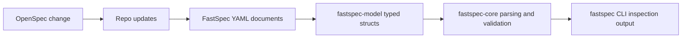

## Context

FastSpec currently validates example documents by walking the filesystem, reading YAML as raw text, and inferring only the top-level `kind:` value. That keeps the bootstrap slice small, but it prevents the runtime from checking required fields or exposing structured document data through the CLI.

This change introduces the first typed runtime layer for durable FastSpec YAML artifacts. OpenSpec remains the short-lived planning layer, while the new Rust parsing model operates on long-lived YAML files under `templates/` and `examples/`.

For retrieval, this keeps the durable knowledge in YAML while giving humans and agents a typed runtime view that can be queried, validated, and surfaced in terminal workflows.

## Goals / Non-Goals

**Goals:**
- Parse current FastSpec YAML documents into typed Rust structures.
- Validate required document fields beyond the current `kind` string check.
- Expose parsed document details through the CLI in a stable human-readable format.
- Keep the implementation small and aligned with the existing example and template set.

**Non-Goals:**
- Introduce schema generation or JSON Schema output.
- Implement app generation, mutation workflows, or network services.
- Support every future FastSpec field shape in this slice.

## Decisions

Use `serde` and `serde_yaml` for the initial parsing layer.
Rationale: the repo is already YAML-first, and `serde` gives a compact path to typed document models without writing a custom parser.
Alternative considered: continue with ad hoc string scanning. Rejected because it does not scale to field validation or structured CLI output.

Represent supported documents with explicit Rust structs and a tagged enum for known document kinds.
Rationale: this allows the CLI and validation logic to operate on shared typed data instead of duplicating field extraction.
Alternative considered: parse into generic maps. Rejected because it weakens compile-time guarantees and keeps downstream code stringly typed.

Keep validation in `fastspec-core` and keep pure data types in `fastspec-model`.
Rationale: it preserves the existing crate split and keeps the model reusable for future consumers beyond the CLI.
Alternative considered: move everything into the CLI. Rejected because it would collapse the intended architecture too early.

Use a human-readable inspect command rather than machine-oriented JSON in this slice.
Rationale: the immediate user is a contributor working in the terminal, and readable output is enough to prove the typed parsing layer.
Alternative considered: JSON-first output. Rejected for now to keep the CLI surface minimal.

## Risks / Trade-offs

[Field drift between examples and typed structs] -> Keep the initial model limited to fields already present in templates and examples, and cover them with tests.

[CLI output becomes a dead-end format] -> Keep the parsed data model separate from rendering so JSON or richer output can be added later without rewriting parsing.

[Overfitting to the current example] -> Parse shared metadata and spec-specific sections conservatively, leaving room to extend structs in later changes.
