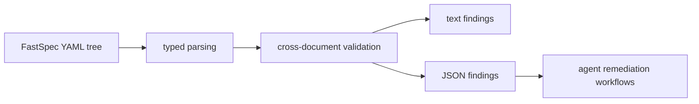

## Context

FastSpec now has typed parsing and machine-readable CLI output, but it still treats validation mostly as "can this YAML parse?" That is not enough for agent workflows, because many useful problems only appear once multiple documents are considered together.

This change adds a validation layer on top of the typed runtime model. OpenSpec continues to define the short-lived implementation slice, while the Rust runtime produces durable validation findings over the FastSpec YAML tree that agents and humans can inspect in text or JSON form.

For retrieval, this keeps the YAML as the source of truth and extends the runtime with structured findings that downstream tools can consume directly.

## Goals / Non-Goals

**Goals:**
- Add a `validate` command for FastSpec files and trees.
- Report explicit findings rather than only pass/fail parse behavior.
- Support both human-readable and JSON validation output.
- Validate a first set of cross-document relationships present in the example tree.

**Non-Goals:**
- Implement a full schema engine or policy DSL.
- Validate every possible semantic rule across all future spec types.
- Mutate documents automatically to fix findings.

## Decisions

Represent validation output as explicit finding structs with severity, code, message, path, and document identifier context.
Rationale: this gives both humans and agents stable data to reason over, and it aligns with the existing JSON CLI direction.
Alternative considered: emit only strings. Rejected because it is harder to consume programmatically and harder to test.

Make validation a dedicated CLI command instead of overloading `summary` or `inspect`.
Rationale: validation is a separate operator intent and should be invocable directly in CI and automation.
Alternative considered: fold validation into `summary`. Rejected because summary and validation have different output semantics.

Start with repository-relevant cross-document rules: duplicate IDs, project/module list consistency, and internal module dependency references.
Rationale: these are already meaningful for the current example and avoid inventing speculative rules.
Alternative considered: add many heuristic checks at once. Rejected because it would increase ambiguity and maintenance cost too early.

## Risks / Trade-offs

[Validation scope is too narrow] -> Keep the finding model extensible so later changes can add rules without redesigning the command.

[Dependency references are ambiguous between internal and external IDs] -> Only treat a dependency as internal when it matches a project-declared module identifier.

[Agents depend on unstable finding codes] -> Use explicit codes and test them so follow-up changes extend rather than silently replace them.
