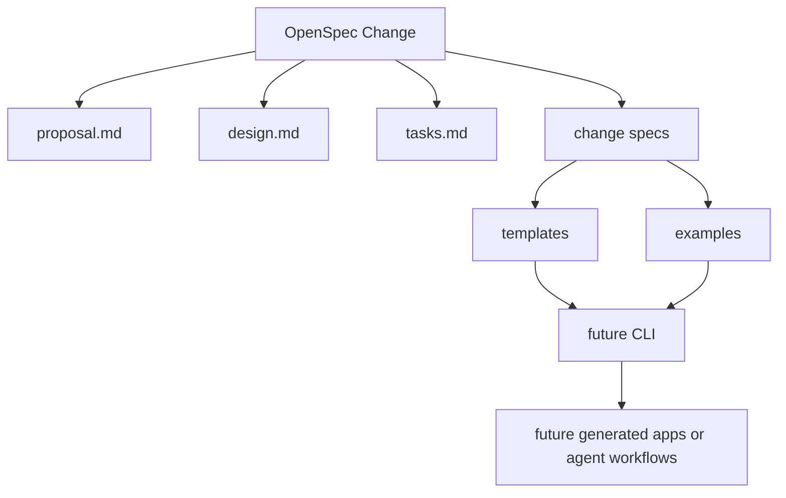

# Design

## Summary

This slice establishes two layers plus a minimal executable surface:

- OpenSpec for change-scoped implementation workflow
- FastSpec YAML for durable project and system knowledge
- a tiny Rust workspace that inspects example documents without external dependencies

That split keeps implementation planning fluid while preserving compact, reusable structured specs for agents.

## Repository Model

## Layout

- `openspec/` stores active changes and future archived specs
- `docs/` explains the project to humans and gives agents compact retrieval entry points
- `templates/` stores reusable YAML documents shaped for low-token reuse
- `examples/archlint-reproduction/` acts as the first creation-oriented example
- `apps/` and `crates/` provide a minimal workspace with one CLI and two small libraries

## Why This Shape

The local FastSpec notes emphasize agent-first operation, YAML artifacts, formal structure, and decentralized composition. The reference repo direction from Factory AI suggests a polished repo with explicit workflows, reusable artifacts, and operator-readable docs. The archlint example request implies the repo also needs a concrete creation example, not just framework prose.

This design satisfies those constraints without pretending the full runtime exists yet. The Rust workspace is intentionally small: it proves the repo shape and validates the example tree, but it does not attempt generation, schemas, or networked tooling.

## Retrieval Implications

- Long-lived knowledge goes into YAML templates and focused docs, not into change tasks
- OpenSpec remains the execution workflow for contributors
- Example specs are colocated under `examples/` so agents can retrieve realistic patterns directly

## Safety And Trust Boundaries

This slice adds no secret handling, network execution, or runtime mutation path. It is limited to repository structure and documentation.
