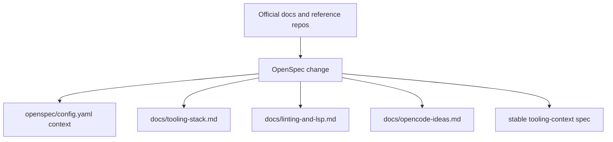

# Design

## Summary

This slice adds durable retrieval-oriented context for the external tooling stack around FastSpec. The content lives in docs and OpenSpec configuration, not in runtime code.

## Structure

## Retrieval Strategy

- `openspec/config.yaml` gets compact, high-signal bullets that help future proposal and design generation.
- `docs/tooling-stack.md` stores the broader multi-tool stack context.
- `docs/linting-and-lsp.md` stores Rust-focused developer-experience guidance.
- `docs/opencode-ideas.md` captures inspiration separately so it is not confused with current FastSpec behavior.

## Rationale

This keeps the always-loaded context short while still preserving detailed reference material in repo-local docs. It also aligns with FastSpec's goal of low-token, reusable project knowledge.
